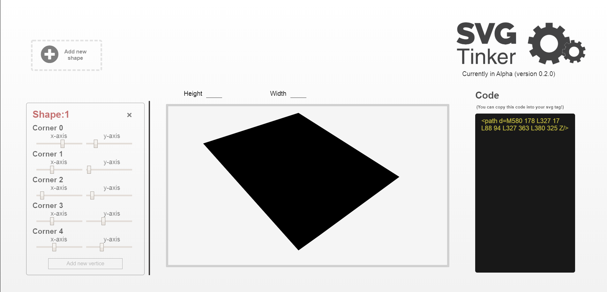
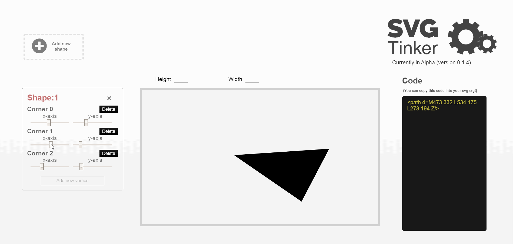
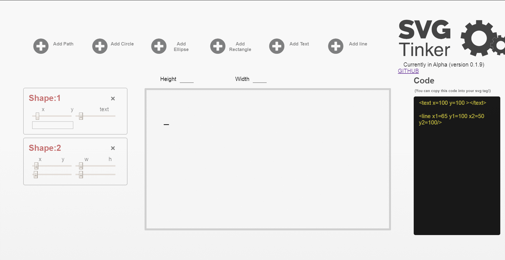
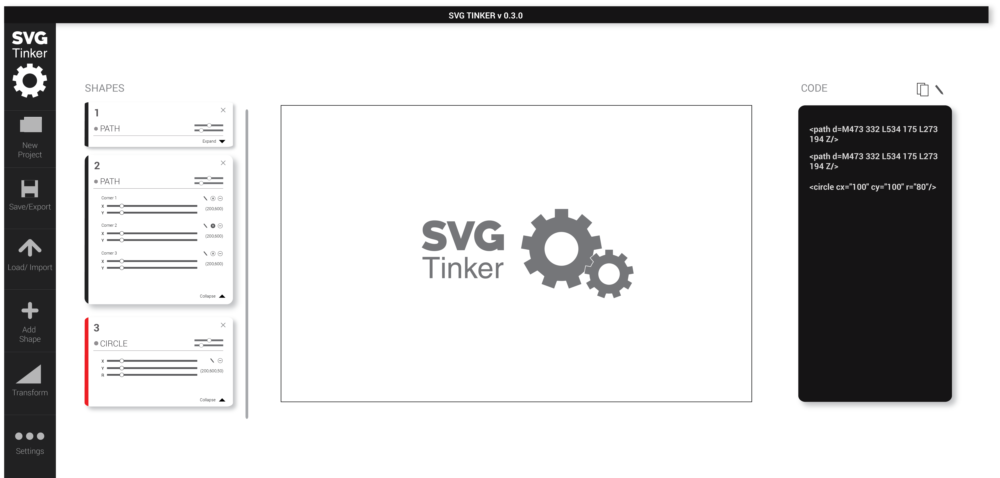
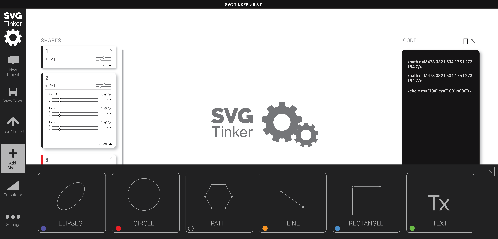

 :gear: A tool for creating and manipulating SVG vectors. :gear:
## Overview

 SVGs are one of the coolest formats out there. The amount of flexiblility and customization that SVGs offer provide us an endless amount creative possiblities. ...But have you ever looked at SVG HTML code? It's quiet daunting to say the least. (Even with the simplest of vector images)

 Hence the focus of this tool is for it to not only act as canvas for creative ideas but also as a compelling educational tool for engineers who want to learn about the anatomy of SVG.



## How to Use
 Use the set of sliders on the left side of the screen to manipulate the cooresponding attributes of a shape. To add another shape to your SVG click the "new shape" button on the side nav bar to bring up the Add Shape menu. Then choose an SVG type among the options. To remove a particular shape click the "x" icon located at the top right of every shape in the control panel.

## Planned features
#### [✔] Add and removal of Path vertices (Each path has 4 currently)
#### [✖] Enable the Path SVGs to also be relatively positioned(Each path is currently using only absolute postioned vertices)   
#### [✖] Enable support for SVG: lines, circles, elipses, polygons, polylines, text, dropshadows, blur effects and filters   
```
     [✔] Circles
     [✔] Elipses
     [✔] Paths
     [✔] Lines
     [✔] Text
     [✔] Rectagles
     [✖] Polygons
     [✖] Polylines
     [✖] Filters

```
#### [✔] Re-design UI
#### [✖] Enable support for applying CSS attributes. Things such as fill, stroke, stroke-width and colors (Any bit of color is hard coded at the moment)
#### [✖] Enable a shape heirachy that can dynamically be changed
#### [✖] Enable user to live code SVG code. (This will require error handling in case the user inserts improper code)
#### [✖] Enable user to import and render svg code (including default or starter shapes like stars or stairs)
#### [✖] Implement Undo/Redo changes made
#### [✖] Implement copy and paste or Duplicate shape feature
#### [✖] Enable shape-highlighting on activation (lets user know what they are manipulating)
#### [✖] Enable user to store SVGs/ save in DB/localstorage etc  
#### [✖] In addition to a Canvas, there should also be a sizable viewbox that overlaps the canvas. Whatever content is within the view box is what will actually be rendered when the code for the SVG is run.
#### [✖] Enable user to use zoom in and out buttons to alter the viewbox 
#### [✖] Adding math tools(ex: user can proportionally resize svgs and/or translate its position within the viewbox.)
#### [✖] Re-name certain components to more understandable names. (ex: "Workspace", "Scape" and "Tools" are vague names)
#### [✖] Implement a "preview mode" for svgs (to give the user a sense of what the svg would realistically look like in an application.)
#### [✖] Fully test the application
```
Write tests for:
     [✔] MasterReducer
     [✔] All other reducers
     [✖] UI Components should look and work as intended:
          [✔] SideNav
          [✖] SvgShape
          [✖] LiveCode
          [✖] Workspace
```
#### [✖] Refactor, Dry up and de-clutter code.

## Planned UI Illustrator Mockup
 
 


