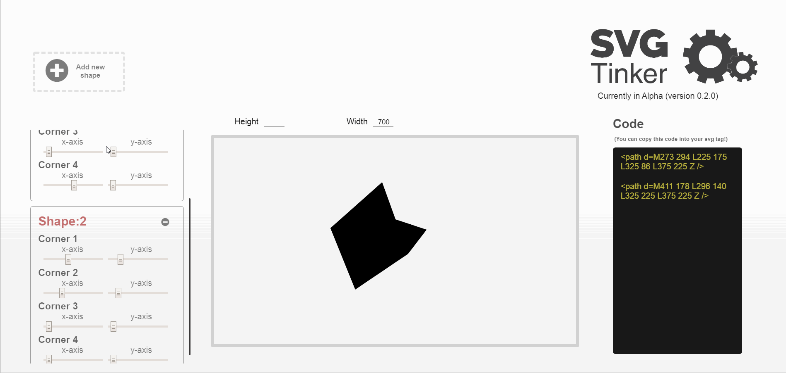

## My Current Thoughts
When the code for SVG-tinker was first written, functionality was only written for Path svgs. All path svgs verticies were hard coded. Each path had 4 verticies. 
There was a pathReducer responsible for Redux state that held an array of Objects. These objects would hold the values/coordinates of each of the 4 points on the path svg. You could then render a UI component (along with a set of sliders) for each object of values/coordinates in that Redux array of objects.

<!--  -->

I layed out a UI design that will work much better than the current one. I'm still on the fence about how it looks (especially with the Nav bar on the left) but functionality is the priority at the moment.
 <!--  -->

Right now Circle svgs are functional. The next thing to do is to replicate the logic used for circles and paths for the other svg types. Things like lines and rectangles should be straight forward since they have a fixed amount of points (like the circle). But things like polylines will be more difficult as they have a dynamic range of points like paths do (thank the lord my bright self decided to do paths first) 

Ellipses are now functional
All of the svg types other than polylines and polygons are now working in the application. I will get to them soon.

### UI
I've begun reworking the UI styling of the application and have run into an issue of being unable to use local image assets withing the application. I am aware that webpack uses file loader and url loader to allow you to "require" an image file but I have been unsuccessful in finding a solution atm. So for now image assets to be used in the application will be hosted on cloudinary.

I've learned a bit about the viewBox property on svg's. It's made me realize that the size of the svg that a user creates with this app could possibly look different when the code is imported into someones application. Several sizing issues could come about. Generally max slider values shouldn't be greater than the height and width of the viewBox.... but what if that is the intention of the user.

Also, upon actually trying to use the sliders to create an image, I realize that the sliders can be a bit difficult to use precisely. Using the arrow keys and the tab button to switch between sliders works nicely. I predict that a user would'nt use the sliders and would probably prefer to use a live coding feature or a drag feature or the arrow keys. 