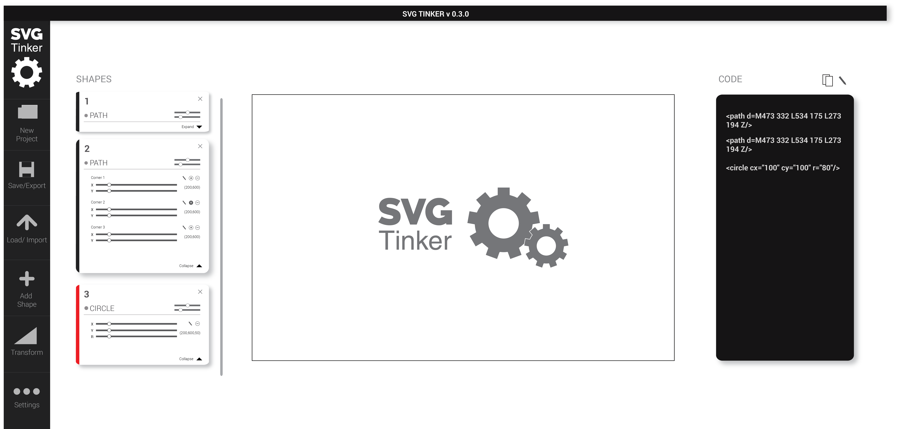

## My Current Thoughts
When the code for SVG-tinker was first written, functionality was only written for Path svgs. All path svgs verticies were hard coded. Each path had 4 verticies. 
There was a pathReducer responsible for Redux state that held an array of Objects. These objects would hold the values/coordinates of each of the 4 points on the path svg. You could then render a UI component (along with a set of sliders) for each object of values/coordinates in that Redux array of objects.

<!--  -->

I layed out a UI design that will work much better than the current one. I'm still on the fence about how it looks (especially with the Nav bar on the left) but functionality is the priority at the moment.
 <!--  -->

Right now Circle svgs are functional. The next thing to do is to replicate the logic used for circles and paths for the other svg types. Things like lines and rectangles should be straight forward since they have a fixed amount of points (like the circle). But things like polylines will be more difficult as they have a dynamic range of points like paths do (thank the lord my bright self decided to do paths first) 

Ellipses are now functional